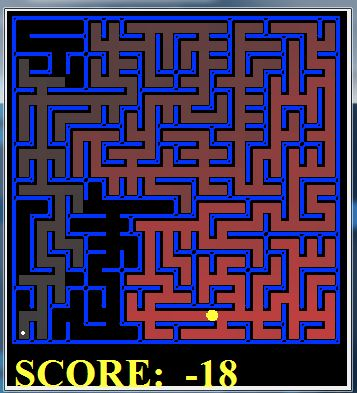
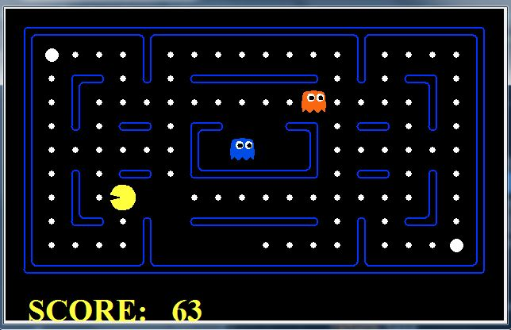
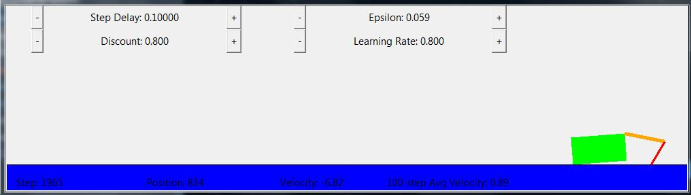
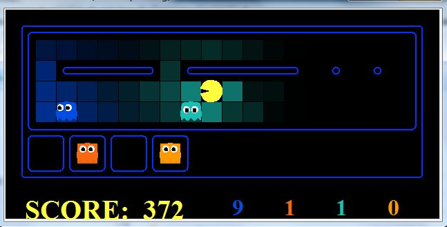
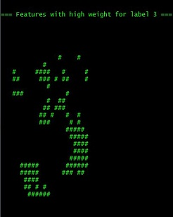

                     ALL HAIL GRANDPAC.
              LONG LIVE THE GHOSTBUSTING KING.

                  ---      ----      ---
                  |  \    /  + \    /  |
                  | + \--/      \--/ + |
                  |   +     +          |
                  | +     +        +   |
                @@@@@@@@@@@@@@@@@@@@@@@@@@
              @@@@@@@@@@@@@@@@@@@@@@@@@@@@@@
            @@@@@@@@@@@@@@@@@@@@@@@@@@@@@@@@@@
            @@@@@@@@@@@@@@@@@@@@@@@@@@@@@@@@@@@@
            \   @@@@@@@@@@@@@@@@@@@@@@@@@@@@@@@@
             \ /  @@@@@@@@@@@@@@@@@@@@@@@@@@@@@@@@
              V   \   @@@@@@@@@@@@@@@@@@@@@@@@@@@@
                   \ /  @@@@@@@@@@@@@@@@@@@@@@@@@@
                    V     @@@@@@@@@@@@@@@@@@@@@@@@
                            @@@@@@@@@@@@@@@@@@@@@@
                    /\      @@@@@@@@@@@@@@@@@@@@@@
                   /  \  @@@@@@@@@@@@@@@@@@@@@@@@@
              /\  /    @@@@@@@@@@@@@@@@@@@@@@@@@@@
             /  \ @@@@@@@@@@@@@@@@@@@@@@@@@@@@@@@@
            /    @@@@@@@@@@@@@@@@@@@@@@@@@@@@@@@
            @@@@@@@@@@@@@@@@@@@@@@@@@@@@@@@@@@@@
            @@@@@@@@@@@@@@@@@@@@@@@@@@@@@@@@@@
              @@@@@@@@@@@@@@@@@@@@@@@@@@@@@@
                @@@@@@@@@@@@@@@@@@@@@@@@@@
                    @@@@@@@@@@@@@@@@@@


# Berkeley Artificial Intelligence CS188

This project contains the coding projects results of the edX Edge course [BerkeleyX: CS188X-8 Artificial Intelligence](https://edge.edx.org/courses/BerkeleyX/CS188x-8/Artificial_Intelligence/course/). Actual code solutions for the exercises are private as the course license does not allow publishing results.

The edx Edge course closes on 31.08.2020. [UC Berkeley CS188](https://inst.eecs.berkeley.edu/~cs188/pacman/home.html) 
has good complementary resources, for example the [Video Lectures](https://inst.eecs.berkeley.edu/~cs188/pacman/lecture_videos.html) or the [Pacman Projects](https://inst.eecs.berkeley.edu/~cs188/pacman/project_overview.html) likely to be available after the course is closed.

I would like to thank Berkeley University and professors Dan Klein and Pieter Abbeel for their work and generosity in making the courses and the projects publicly available. I would also like to thank edX Edge for making the Course with its Homeworks available: the Homeworks provided a good insight into the courses and were a useful springboard for the coding Projects.


## Projects

* [Project 0: Unix/Python/Autograder Tutorial](https://inst.eecs.berkeley.edu/~cs188/pacman/tutorial.html) - Unix/Python/Autograder tutorial.
* [Project 1: Informed and uninformed searches](https://inst.eecs.berkeley.edu/~cs188/pacman/search.html) - Uninformed (DFS, BFS, UCS) and informed (Greedy, A-star) searches.
* [Project 2: Adversarial search](https://inst.eecs.berkeley.edu/~cs188/pacman/multiagent.html) - Reflex agents, Minimax, Alpha-Beta pruning, Expectimax.
* [Project 3: Reinforcement learning](https://inst.eecs.berkeley.edu/~cs188/pacman/reinforcement.html) - Value iteration, Q Learning, Q Learning tuning.
* [Project 4: Bayes Nets](https://inst.eecs.berkeley.edu/~cs188/pacman/tracking.html) - Markov models, HMM, Particle filtering.
* [Project 5: Classification](https://inst.eecs.berkeley.edu/~cs188/pacman/classification.html) - Perceptrons,  MIRA, Feature design, Behavioral cloning.
Project 5 was sourced from [University of Texas spring 2015 course](http://www.cs.utexas.edu/~pstone/Courses/343Hspring15/assignments/05-classification/05-classification.html) and contains one extra exercise compared with edx Edge Project 5. The extra exercise implements training and turning for Naive Bayes. 


# Project details and tests

The project code is in "good enough to pass" state. Issues which don't prevent the code from running and being
graded might not be fixed. Comments are added where further improvements are possible but not mandated by the exercises. 
The project code has maximum grades.

 **Project 0: Unix/Python/Autograder tutorial**
 [edX Edge Artificial Intelligence - BerkeleyX CS188X-8 course/Project0 introduction](https://edge.edx.org/courses/BerkeleyX/CS188x-8/Artificial_Intelligence/courseware/51edbfdd877a4d0e8d6109c3b9770849/e8c2d3dd71a84472997173f55c98a35c)
 or directly from [UC Berkeley CS188 Intro to AI - Course Materials/Project0 tutorial](https://inst.eecs.berkeley.edu/~cs188/pacman/tutorial.html).
 * [Project 0 run detail.](project0-tutorial/README.md)
 * Results summary:
```buildoutcfg
Provisional grades
==================
Question q1: 1/1
Question q2: 1/1
Question q3: 1/1
------------------
Total: 3/3
```

 **Project 1: Informed and uninformed searches**  
 
   
 
 [edX Edge Artificial Intelligence - BerkeleyX CS188X-8 course/Project1 introduction](https://edge.edx.org/courses/BerkeleyX/CS188x-8/Artificial_Intelligence/courseware/51edbfdd877a4d0e8d6109c3b9770849/6171e5fdfd8645c98cdcdf53dfea1880/).
   * Question 1, DFS: Depth first search. Stack as a fringe. I keep a path (List) from root -> to current search Node from the fringe. That to be able to return the path once it is found. 
   * Question 2, BFS: Breath first search. Queue as a fringe, only the fringe is different when comparing with DFS.
   The actual search code implemented
  as a separate method is called by breadthFirstSearch() method without changes.
   * Question 3, UCS: Uniform cost search. util.PriorityQueue as a fringe.
   * Question 4, Informed search, A* algorithm: PriorityQueue as a fringe.
    Cost is the difference when compare with UCS, it includes now the heuristics on top of UCS.
   * Question 5, Corners problem: implemented the state abstraction, successor states, 
  and goal checking.
   * Question 6, Corners problem: add heuristic to problem 5.
   * Question 7, Eating all the dots: performance of the heuristic function. Rather difficult. 
   Solved by splitting the food into food clusters and fixing the Manhattan distances for hinged walls. The distance
   between the clusters is computed in a rather brutish way, use e.g. closestToTargetsWithWalls method from Project 2 for 
   a better search.
   * Question 8, Replanning: use uninformed search to find non-optimal but fast solutions where A* will stall.
   * [Project 1 run detail.](project1-search/README.md)
   * Project 1 run summary:
  ```buildoutcfg
Provisional grades
==================
Question q1: 3/3
Question q2: 3/3
Question q3: 3/3
Question q4: 3/3
Question q5: 3/3
Question q6: 3/3
Question q7: 5/4
Question q8: 3/3
------------------
Total: 26/25
```
   
 **Project 2: Adversarial search**  
 
  
 
 [edX Edge Artificial Intelligence - BerkeleyX CS188X-8 course/Project2 introduction](https://edge.edx.org/courses/BerkeleyX/CS188x-8/Artificial_Intelligence/jump_to/i4x://BerkeleyX/CS188x-8/sequential/52a12229526341c4b605cdd2b5ae295d)
  
   * Question 1, Reflex Agent. 
   * Question 2, Minimax: The sliding depth searching challenging, especially as the tests did not verify it 
  but then it was used into and consequently crashed the last game. 
   * Question 3, Expectimax. 
   * Question 4, Better evaluation function for Expectimax: Implemented BFS to check on actual distance
     to food. featureExtractors.py has a good sample on how to do it. 
     You might want to reuse this for Project 1 Question 7 tricky search. With my original Expectimax 
     implementation the Pacman will often freeze before the last
                food pellet, and wait for ghost to scare him in order to eat it. The reason was in the 
                2 depth Exectimax search where "Stop" was as good as eating the pellet, as in both cases
                the eating will happen at next step. Nice problem!
   * [Project 2 run detail.](project2-adeversarial-search/README.md)
   * Project 2 run summary:
 ```buildoutcfg
Provisional grades
==================
Question q1: 4/4
Question q2: 5/5
Question q3: 5/5
Question q4: 5/5
Question q5: 6/6
------------------
Total: 25/25
```

  **Project 3: Reinforcement learning**  
  
  
  
  [edX Edge Artificial Intelligence - BerkeleyX CS188X-8 course/Project3: Reinforcement Learning](https://edge.edx.org/courses/BerkeleyX/CS188x-8/Artificial_Intelligence/courseware/51edbfdd877a4d0e8d6109c3b9770849/41c847d3794141a7acb4f6b1e5904215)
 and  [UC Berkeley CS188 Intro to AI - Course Materials/Project3 tutorial](https://inst.eecs.berkeley.edu/~cs188/pacman/reinforcement.html)
  
   * Question 1, Value Iteration.
   * Question 2, Bridge crossing, value Iteration parameters. 
   * Question 3, Policies, value iteration parameters. 
   * Question 4, Q learning.
   * Question 5, Crawler, epsilon greedy.
   * Question 6, Bridge crossing reloaded, with Q learning.
   * Question 7, Approximate Q learning, exploration versus exploitation. The need for features.
   * Question 8, Q learning that learns weight for features. Neural networks are getting closer.
   * [Project 3 run detail.](project3-reinforcement-learning/README.md)
   * Project 3 run summary.
```buildoutcfg
Provisional grades
==================
Question q1: 6/6
Question q2: 1/1
Question q3: 5/5
Question q4: 5/5
Question q5: 3/3
Question q6: 1/1
Question q7: 1/1
Question q8: 3/3
------------------
Total: 25/25
```  
 
**Project 4: Bayes nets (Ghostbusters)**  

 

 [edX Edge Artificial Intelligence - BerkeleyX CS188X-8 course/Project4: Ghost busters](https://edge.edx.org/courses/BerkeleyX/CS188x-8/Artificial_Intelligence/courseware/51edbfdd877a4d0e8d6109c3b9770849).
  
   * Question 1, Exact inference, Observation. 
   * Question 2, Exact inference, Time Lapse.
   * Question 3, Exact inference, action based on both Observation and Time Lapse.
   * Question 4, Approximate inference, Observation
   * Question 5, Approximate inference, with both Observation and Time Elapse
   * Question 6, Joint particle, Observation (tracking related hidden variables, like ghosts sharing a relationship)
   * Question 7, Joint particle, Time Lapse.
   * [Project 4 run detail.](project4-bayes-nets/README.md)
   * Project 4 run summary:
  ```buildoutcfg
Provisional grades
==================
Question q1: 3/3
Question q2: 4/4
Question q3: 3/3
Question q4: 3/3
Question q5: 4/4
Question q6: 4/4
Question q7: 4/4
------------------
Total: 25/25
```

 **Project 5: Classification**  
 
 
 
 [edX Edge Artificial Intelligence - BerkeleyX CS188X-8 course/Project5: Classification](https://edge.edx.org/courses/BerkeleyX/CS188x-8/Artificial_Intelligence/courseware/51edbfdd877a4d0e8d6109c3b9770849)
 and [Project 5: Classification](http://www.cs.utexas.edu/~pstone/Courses/343Hspring15/assignments/05-classification/05-classification.html)
 
   * Question 1, The Perceptron.
   * Question 2, Analyzing the Perceptron, weights visualisation.
   * Question 3, MIRA Margin Infused Relaxed Algorithm, updates the weights of the perceptron with a variable coefficient.
   * Question 4, Digit Feature Design, extract features from binary data.
   * Question 5, Behavioral Cloning.
   * Question 6, Features for Behavioral Cloning.
   * [Project 5 run detail](project5-classification/README.md)
   * Results summary:
```buildoutcfg
Provisional grades
==================
Question q1: 4/4
Question q2: 1/1
Question q3: 6/6
Question q4: 6/6
Question q5: 4/4
Question q6: 4/4
------------------
Total: 25/25

```
  
  
  
  


  
   
  
 


